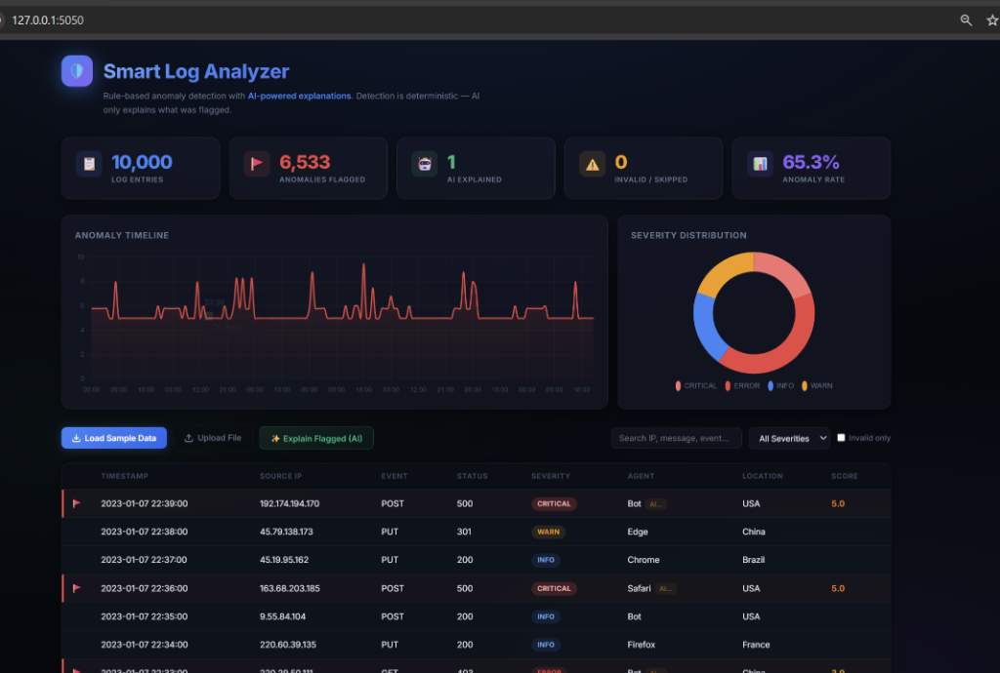
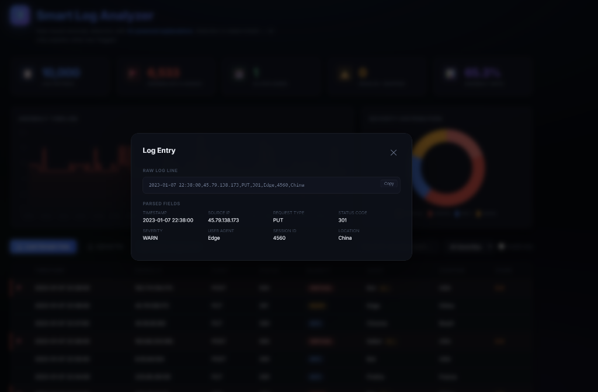
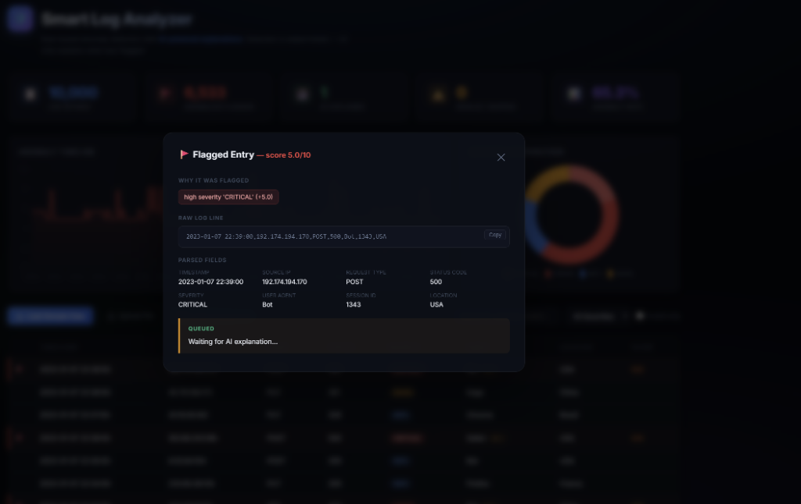

<div align="center">

# 🛡️ Smart Log Analyzer & Anomaly Detector

**Rule-based anomaly detection with AI-powered explanations**

[](https://python.org)
[](https://fastapi.tiangolo.com)
[](https://sqlite.org)
[](https://chartjs.org)
[](LICENSE)

*Ingests server log data, flags anomalies using a deterministic multi-signal scoring engine (no AI in detection), then uses an LLM to explain each flag in plain English.*

</div>

---

## 📸 Screenshots

### Dashboard Overview
> Stats cards, anomaly timeline, and severity distribution — all at a glance.



### Log Entry Details
> Detailed view of a parsed log entry with raw data and formatting.



### AI Explanation Queued
> The system preparing to fetch plain English explanation for the flagged anomaly.



---

## ⚡ Quick Start

```bash
# 1. Clone the repo
git clone https://github.com/YOUR-USERNAME/smart-log-analyzer.git
cd smart-log-analyzer

# 2. Install dependencies
cd backend
pip install fastapi uvicorn python-multipart

# 3. Run the server
uvicorn main:app --reload --port 5050

# 4. Open in browser
# → http://127.0.0.1:5050
```

Click **"Load Sample Data"** in the dashboard to ingest the assignment dataset (10,000 log entries), or upload your own `.log` / `.csv` file.

---

## 🧠 How the Anomaly Detection Works

Detection is **100% deterministic and rule-based** — no AI involved. Each log entry is scored from 0 to 10 using **6 independent signals**. Anything scoring **≥ 2.0** is flagged.

```
Final Score = Signal₁ + Signal₂ + Signal₃ + Signal₄ + Signal₅ + Signal₆ (capped at 10)
```

| # | Signal | Max Points | What It Checks |
|---|---|---|---|
| 1 | **Severity Weight** | +5.0 | HTTP status → CRITICAL (500+), ERROR (400+), WARN (300+) |
| 2 | **IP Volume Spike** | +3.0 | Z-score of per-IP request counts (flags IPs >2σ above mean) |
| 3 | **Error Rate Burst** | +3.0 | Z-score of per-minute error rate (catches cascading failures) |
| 4 | **Rare Status Code** | +1.0 | Error codes that appear in <1% of traffic |
| 5 | **Failure Streak** | +1.5 | 3+ consecutive failures from the same IP (brute-force pattern) |
| 6 | **Off-Hours Activity** | +0.8 | Requests between 00:00–06:00 (night-time anomalies) |

> **Key math:** Signals 2 and 3 use **z-scores** (how many standard deviations from the mean). A z-score > 2.0 means the value is statistically unusual.

### Example Scoring

| Signal | Status | Points |
|---|---|---|
| Status 500 → CRITICAL | ✅ | +5.0 |
| IP made 150 requests (z=2.5) | ✅ | +0.6 |
| 80% error rate this minute (z=3.1) | ✅ | +1.9 |
| Status 500 is common (8%) | ❌ | 0 |
| 4 consecutive failures | ✅ | +1.5 |
| Timestamp: 2:15 AM | ✅ | +0.8 |
| **Total** | | **9.8 / 10** 🚩 |

---

## 🤖 AI Explainer

AI is used **only after** detection — to explain what was flagged, not to decide what's anomalous.

For each flagged entry, the system sends the log data + detection reasons to an LLM and gets back:
- **Explanation** — what happened in plain English
- **Root Cause** — most likely reason
- **Next Step** — one action for an engineer

### Setup

Create `backend/.env`:

```env
OPENROUTER_API_KEY=sk-or-v1-your-key-here
```

Model: `stealth/ox-alpha` via [OpenRouter](https://openrouter.ai) (configurable in `ai_explainer.py`).

A background worker automatically explains pending flags every 20 seconds.

---

## 🗂️ Project Structure

```
smart-log-analyzer/
├── backend/
│   ├── main.py            # FastAPI app + API routes
│   ├── parser.py           # Log parsing (auto-detects CSV, pipe, free-form)
│   ├── detector.py         # 6-signal anomaly scoring engine
│   ├── db.py               # SQLite persistence + chart queries
│   ├── ai_explainer.py     # OpenRouter LLM integration
│   └── generate_data.py    # Synthetic data generator (fallback)
├── frontend/
│   └── index.html          # Single-page dashboard (Chart.js + glassmorphism)
├── data/
│   └── log-data.csv        # Assignment dataset (10,000 entries)
├── screenshots/
│   ├── dashboard.png
│   ├── log-table.png
│   ├── detail-modal.png
│   └── footer.png
└── README.md
```

---

## 📡 API Reference

| Method | Endpoint | Description |
|---|---|---|
| `POST` | `/api/ingest/sample` | Load assignment CSV dataset |
| `POST` | `/api/ingest/file` | Upload a custom .log/.csv file |
| `POST` | `/api/ingest/text` | Paste raw log lines |
| `GET` | `/api/logs` | Browse entries (supports `?severity=`, `?search=`, `?limit=`, `?offset=`) |
| `GET` | `/api/flags` | All flagged entries with scores and AI output |
| `GET` | `/api/stats` | Dashboard counters |
| `GET` | `/api/charts/timeline` | Time-bucketed anomaly data |
| `GET` | `/api/charts/severity` | Severity distribution |
| `GET` | `/api/charts/top-ips` | Top flagged IPs |
| `POST` | `/api/explain` | Trigger AI explanation on pending flags |

---

## 📊 Assignment Dataset

Data source: [Anchit-Nayak/Assignment-Data](https://github.com/Anchit-Nayak/Assignment-Data)

| Column | Example | Maps To |
|---|---|---|
| `Timestamp` | `2023-01-01 00:00:00` | Timestamp |
| `IP_Address` | `202.118.116.11` | Source IP |
| `Request_Type` | `GET`, `POST`, `DELETE`, `PUT` | Event Type |
| `Status_Code` | `200`, `403`, `500` | Status Code → Severity |
| `User_Agent` | `Chrome`, `Firefox`, `Bot` | User Agent |
| `Session_ID` | `4835` | Session ID |
| `Location` | `Brazil`, `China`, `India` | Location |

**Results:** 10,000 entries → **6,533 anomalies flagged** (65.3% rate)

---

## 🎨 Design

- **Theme:** Dark glassmorphism with `backdrop-filter: blur()`
- **Typography:** [Inter](https://fonts.google.com/specimen/Inter) (Google Fonts)
- **Charts:** Chart.js v4 — anomaly timeline + severity doughnut
- **Animations:** Gradient header, icon pulse, card hover glow, modal slide-in
- **Responsive:** Works on mobile viewports

---

## 🛠️ Tech Stack

| Layer | Technology |
|---|---|
| Backend | Python + FastAPI |
| Database | SQLite |
| Detection | Pure Python (z-scores + heuristics) |
| AI | OpenRouter API (LLM) |
| Frontend | Vanilla HTML/CSS/JS |
| Charts | Chart.js v4 |

---

<div align="center">

**Built with ❤️ for Digi Plus**

</div>
